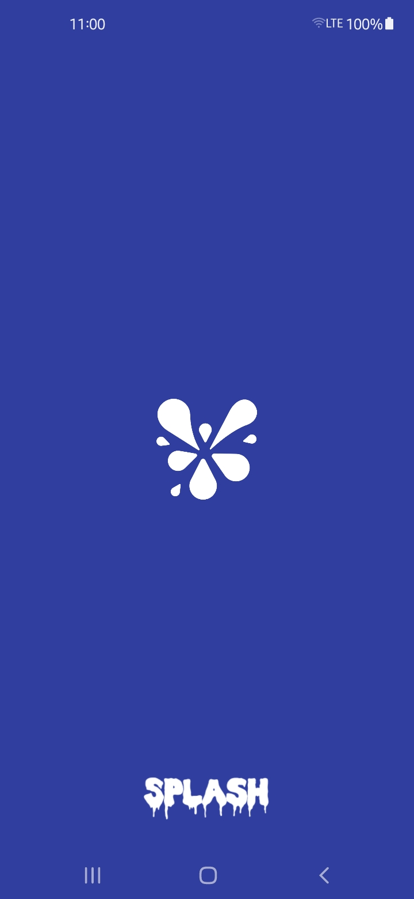
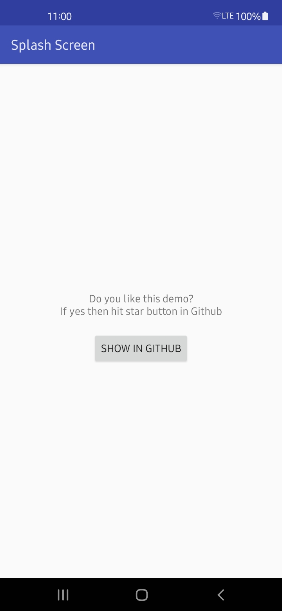

# SplashScreen
Splash screen demo made in right way(for Android)

# ScreenShots

 

# Usual mistake
Most of the answers for SplashScreen are by using Timer to delay!
But it isn't a good way to show SplashScreen! We should not make the users to wait for loading nothing. As app loads with white or black screen and the users wait until the timer finishes.
So I made this demo on how to show real SplashScreen on Android.

# Note
If you are using Vector Drawables then place those drawables in mipmap folder (Works only in api 21 and up).

# For Androidx (theme)
<resources
    xmlns:tools="http://schemas.android.com/tools">

    <!--Common App theme-->
    

    <!--Splash Theme-->
    

</resources>

# Icons
Launcher Icon from [Flaticon](https://flaticon.com) - Freepik
